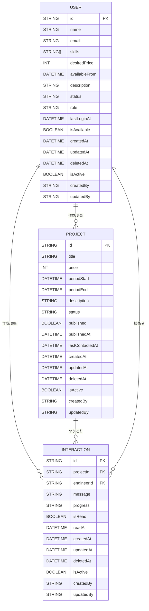

# データモデル設計書（SES案件・技術者管理アプリ/MVP）

---

## ER図（Mermaid記法）



---

## テーブル定義

### 1. User（技術者/管理者など認証ユーザー）
| カラム名         | 型         | 説明                       |
|------------------|------------|----------------------------|
| id               | String     | 主キー（UUID）             |
| name             | String     | 氏名                       |
| email            | String     | メールアドレス（認証用）   |
| skills           | String[]   | スキル（配列）             |
| desiredPrice     | Int        | 希望単価                   |
| availableFrom    | DateTime   | 稼働可能日                 |
| description      | String     | 技術者詳細                 |
| status           | String     | 稼働中/稼働可能など        |
| role             | String     | 権限（admin/sales等）      |
| lastLoginAt      | DateTime?  | 最終ログイン日時           |
| isAvailable      | Boolean    | 現在稼働可能か             |
| createdAt        | DateTime   | 作成日時                   |
| updatedAt        | DateTime   | 更新日時                   |
| deletedAt        | DateTime?  | 論理削除                   |
| isActive         | Boolean    | 有効/無効                  |
| createdBy        | String?    | 作成者ID（User.id）        |
| updatedBy        | String?    | 更新者ID（User.id）        |

> **備考**: `role`カラムを追加し、管理者・営業などの権限管理に対応。

---

### 2. Project（SES案件）
| カラム名         | 型         | 説明                       |
|------------------|------------|----------------------------|
| id               | String     | 主キー（UUID）             |
| title            | String     | 案件名                     |
| price            | Int        | 単価                       |
| periodStart      | DateTime   | 開始日                     |
| periodEnd        | DateTime   | 終了日                     |
| description      | String     | 案件詳細（自由記述欄。要件・条件・備考などをまとめて記載） |
| status           | String     | 募集中/マッチング済/終了   |
| published        | Boolean    | 公開/非公開                |
| publishedAt      | DateTime?  | 公開日時                   |
| lastContactedAt  | DateTime?  | 最後のやりとり日時         |
| createdAt        | DateTime   | 作成日時                   |
| updatedAt        | DateTime   | 更新日時                   |
| deletedAt        | DateTime?  | 論理削除                   |
| isActive         | Boolean    | 有効/無効                  |
| createdBy        | String?    | 作成者ID（User.id）        |
| updatedBy        | String?    | 更新者ID（User.id）        |

> **備考**: 案件の詳細情報（要件、条件、備考、連絡先など）は、`description`（自由記述欄）にまとめて記載し、将来的な項目追加や仕様変更にも柔軟に対応できるようにしています。

---

### 3. Interaction（やりとり/メッセージ）
| カラム名         | 型         | 説明                       |
|------------------|------------|----------------------------|
| id               | String     | 主キー（UUID）             |
| projectId        | String     | 案件ID（Project.id）       |
| engineerId       | String     | 技術者ID（User.id）        |
| message          | String     | メッセージ本文             |
| progress         | String     | 進捗（面談予定等）         |
| isRead           | Boolean    | 既読フラグ                 |
| readAt           | DateTime?  | 既読日時                   |
| createdAt        | DateTime   | 作成日時                   |
| updatedAt        | DateTime   | 更新日時                   |
| deletedAt        | DateTime?  | 論理削除                   |
| isActive         | Boolean    | 有効/無効                  |
| createdBy        | String?    | 作成者ID（User.id）        |
| updatedBy        | String?    | 更新者ID（User.id）        |
``` 