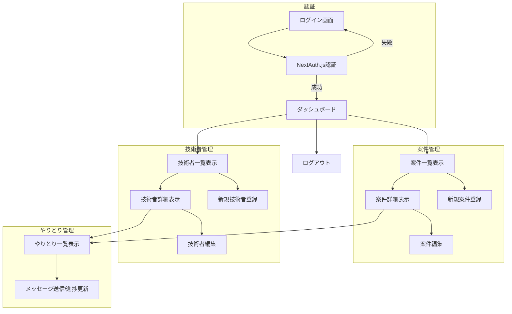

# SES案件・技術者管理アプリ 要件定義（MVP）最終ドキュメント

---

## プロジェクトルール抜粋

- 技術スタックの詳細は `technologystack.md` を参照のこと
- 技術スタックの変更・追加は必ず事前承認を得ること
- Next.js（API Routes含む）＋ Prisma（ORM）＋ SQLite
- 認証はNextAuth.js、デプロイはVercel
- コード・データ設計・画面設計はMVP最小構成を優先
- 権限管理（ロール）は「admin」「sales」を想定
- 各テーブルに管理用カラム（created_at, updated_at, created_by, updated_by）を付与

---

## 要件ジャッジ結果

- やるべきか？：Yes（MVPとして必須）
- 優先度：高
- 影響範囲：案件・技術者・やりとり・ユーザー管理全般
- 判断理由：SES案件管理のMVPとして、最低限必要な機能・構成

---

## 変更対象ファイル・関数リスト

- `/pages/api/projects/`（案件API）
- `/pages/api/engineers/`（技術者API）
- `/pages/api/messages/`（やりとりAPI）
- `/pages/api/auth/`（認証API）
- `/prisma/schema.prisma`（データモデル定義）
- `/pages/projects/`（案件画面）
- `/pages/engineers/`（技術者画面）
- `/pages/messages/`（やりとり画面）
- `/pages/login.tsx`（ログイン画面）
- `/pages/logout.tsx`（ログアウト画面）

---

## データ設計方針

### Project（案件）テーブル
- id, name, price, period_start, period_end, skills, location, detail, status
- created_at, updated_at, created_by, updated_by

### Engineer（技術者）テーブル
- id, name, skills, desired_price, available_from, detail, status
- created_at, updated_at, created_by, updated_by

### Message/Progress/History（やりとり）テーブル
- id, project_id, engineer_id, message, progress, created_at, updated_at, created_by, updated_by

### User（管理者ユーザー）テーブル
- id, email, password, role（admin/sales）, created_at, updated_at

---

## 画面設計方針

- 案件一覧・詳細画面
- 技術者一覧・詳細画面
- やりとり一覧画面
- ログイン・ログアウト画面
- UI/UXはシンプルな構成、MVPに必要な項目のみ

---

## 処理フロー（mermaid）

---

## 開発工数見積

- データモデル設計・Prismaスキーマ作成：1日
- 認証（NextAuth.js）実装：0.5日
- 案件API・画面実装：1.5日
- 技術者API・画面実装：1.5日
- やりとりAPI・画面実装：1日
- 権限管理（ロール制御）実装：0.5日
- テスト・動作検証：1日
- ドキュメント整備：0.5日

**合計：約7日（1人）**

---

## 未確定事項 & TODO

- [要確認] ロールごとの具体的な操作権限範囲
- [要確認] 技術者本人やクライアントのログイン・操作要件（将来的な拡張想定）
- [要確認] メッセージ・進捗の履歴管理の粒度

---

以上がMVP要件定義の最終ドキュメントとなります。 